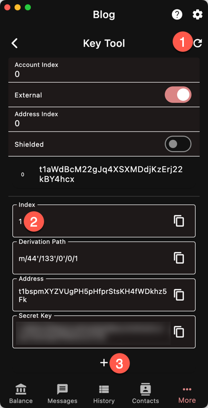
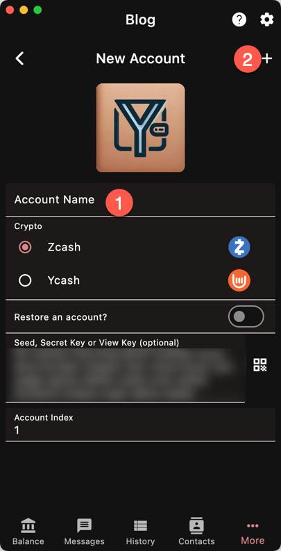

import { Callout } from "nextra/components"

<Callout type="warning">
Be adviced that Binance (and potentially other exchanges
soon) has started to **NOT CREDIT** deposits from shielded
notes.
</Callout>

This is very important to know because the protocol
does not enforce this restriction. Moreover, by
default, shielded wallets will *privilege* sending
from *shielded* notes. 

> Your funds will be **LOCKED**.

Binance receives the funds but will not *credit* your account.
You will have to open a support ticket and wait for a refund.
This can take up to 30 business days while your funds
are unavailable.

Here's the workflow that I *personally use*. Though I cannot
guarantee it works for everyone. 

## Setup

- Create *one* account for *all* the exchanges you work with
(not one per exchange);
- Make a backup of the seed and put it in a safe place;
- Assign an index to each exchange. For example, Binance could be 1,
Kraken 2, etc.

## Deposits

For deposits, you **must** make sure your funds come from a
transparent address. 

- With the "Exchange" account selected, use the
[Keytool](/tools/key_derivation):

    1. Refresh to populate the list
    1. Expand the address at the index you want
    1. Press "+" to create a new account. Call it "Binance" for example.

- Make a payment to the "Binance" account transparent address;
- Shielded inputs is *highly* recommended;
- Wait for 3 or more confirmations;
- Switch to the "Binance" account
- Make a deposit to the exchange address. Check that it is only using
**transparent inputs**. If you did the previous step correctly, the
temporary account only has transparent funds. Otherwise, you can
use the custom send option and deselect the Sapling and Orchard pools.

<Callout type="info">
The transaction should have "**VERY LOW PRIVACY**" because it is t2t.
</Callout>

## Withdrawals

- Do the same as before, but send to the temporary account;
- Then send from the temporary account to your main account with a
shielded destination address.

## Cleanup

Delete the temporary account if you want.

If you only perform transparent transactions on an Exchange account,
there is no need to wait for synchronization. Therefore you can
always quickly recreate it when needed.

## Conclusion

Following this workflow ensures that each exchange has a different
*unlinkable* transparent address.

<Callout type="warning">
However, you should not immediately transfer from one exchange to
another because the **timing** and **amount** would easily give away
the link between your addresses!
</Callout>
