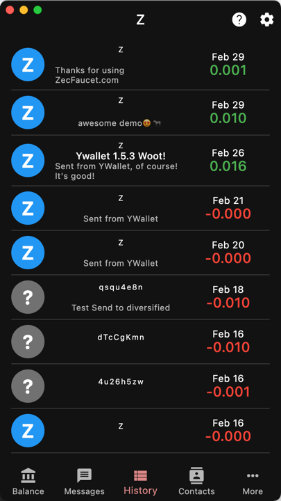
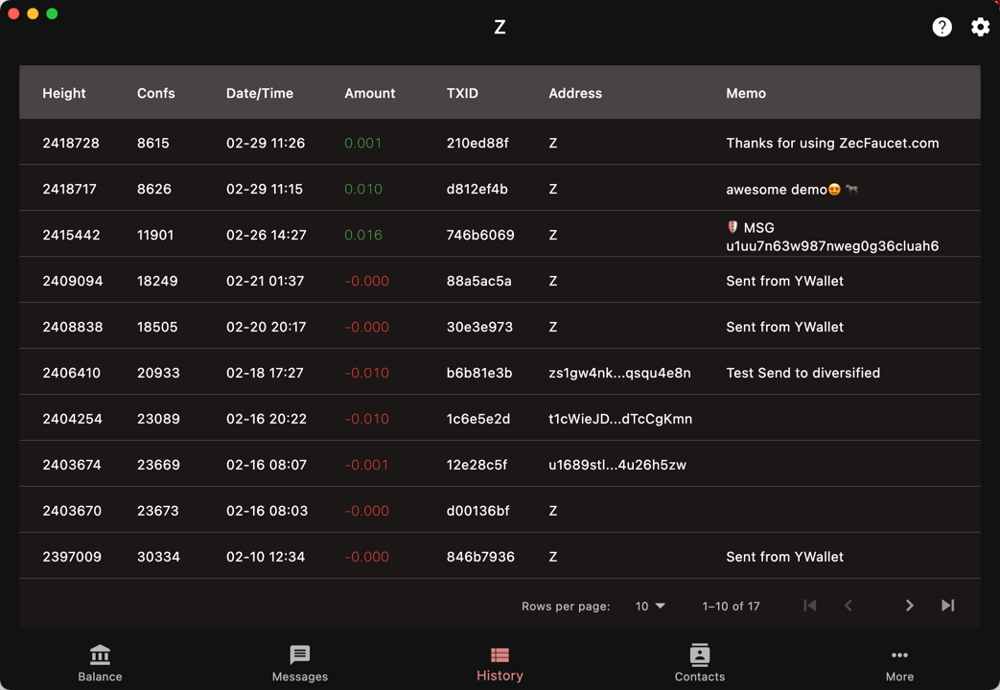

import { Callout } from "nextra/components"

`History`

This is your transaction history.

It can be displayed in table or list layout.

## List

## Table

The table format shows more information and is
better suited for larger screen.

You can also sort the columns by clicking on
the column headers.

The layout can be selected in the
[settings](/settings/view)

Clicking or tapping on a transaction will
navigate to the
[transaction details](/history/details).

<Callout type = "warning">
Transactions that do not involve any shielded
input/output, i.e `t2t` or `z2t` from an external
payer will **NOT** appear in your history. Your
account balance includes the transparent funds
at the *first* index.
</Callout>

The server does not send `t2t` transactions.
`z2t` transactions are sent but they don't have
shielded incoming funds.

Ywallet retrieves the transparent balance using
a separate API call that does not require
synchronization.
