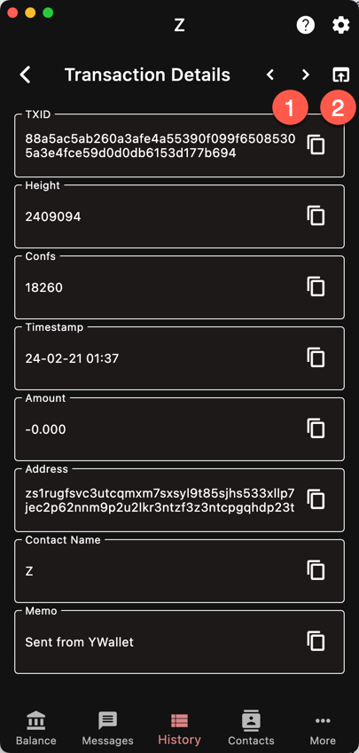

Any piece of information from that page can
be copied to the clipboard.

1. Navigate to previous/next transaction
1. Open the block explorer on the current transaction

The block explorer can be selected in the
[settings](/settings/coin#explorer).
