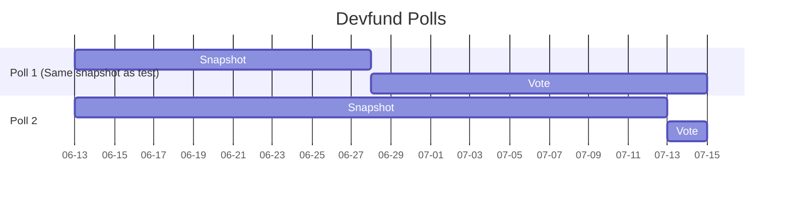
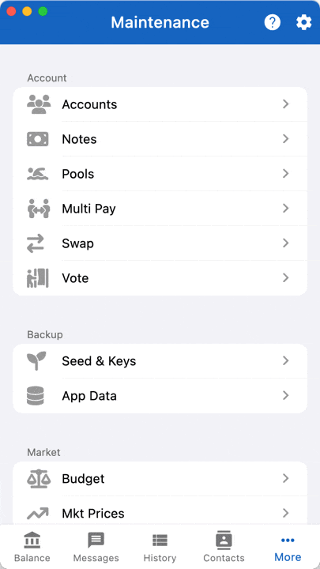

import { useState, useEffect } from 'react'
import { Callout } from "nextra/components"

## Polls

export function ElectionJson(props) {
    const [data, setData] = useState([])
    useEffect(() => {
        async function f() {
            let api = await fetch(`https://vote.zcash-infra.com/${props.id}`)
            let results = await api.json()
            setData(results)
        }
        f()
    }, [])
    return <pre>{JSON.stringify(data, null, 2)}</pre>
}

## Poll 1

<ElectionJson id="devfund-proposals"/>

The first poll uses the snapshot height of the trial run. You do not have
to move your funds to participate. It closes on Jul 15th.

Use this vote url: `https://vote.zcash-infra.com/devfund-proposals`

## Poll 2

<ElectionJson id="devfund-props"/>

The second poll takes the snapshot at height 2574200. It closes on Jul 15th.

Use this vote url: `https://vote.zcash-infra.com/devfund-props`

<Callout>
There are TWO polls to allow the highest number of people to participate.
Some people were not aware that the first poll snapshot was already taken
and are unable to participate. We are running a second poll *concurrently*
to allow them to join the vote.
</Callout>

## FAQ

1. Who can vote? 
To vote, you must have funds in the Orchard Pool created after block height 
2540000 and before block height 2557150, i.e. *The Registration Window RW*.
Moreover, the funds must be unspent as of block height 2557150.
1. If I don't have funds in the *The Registration Window* can I still
participate?
No, the window is closed now. Even if you move funds, it will not be 
eligible. You may have some funds in the RW, it may be worth checking.
1. Can I spent my funds now?
Yes, moving funds after the RW has no effect on your voting power.
1. Can I vote for more than one proposal?
Yes, but with different notes. You simply repeat the voting process.
1. What *weight* does my vote have?
Your vote is weighted by *the total amount of coins of the notes* you
spent to cast it.

## How do I vote?
    - Use Ywallet version 1.6.3 from github 
https://github.com/hhanh00/zwallet/releases/tag/v1.6.3%2B2
or the mobile versions on the Google and Apple Stores.
    - Go to the More tab and select Vote
    - Enter the URL: https://vote.zcash-infra.com/devfund-proposals
    - Select the note or notes
    - Select the proposal
    - Submit

<Callout>
The generation of the ballot make take a few minutes depending
on how many notes you use and the platform.
</Callout>

## Disclaimer

The mechanism/technology is based on the Coin Voting Proposal (under ZIP review)
and is **not audited** at this time.

For additional safety, the ballot is **not signed with your spending key**.
In fact, it could be created with only the viewing key.
