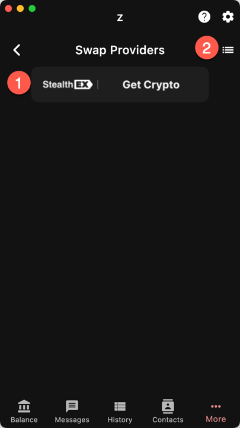
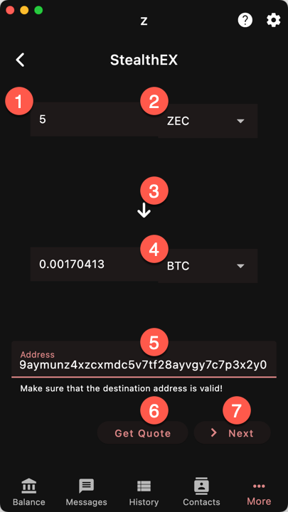
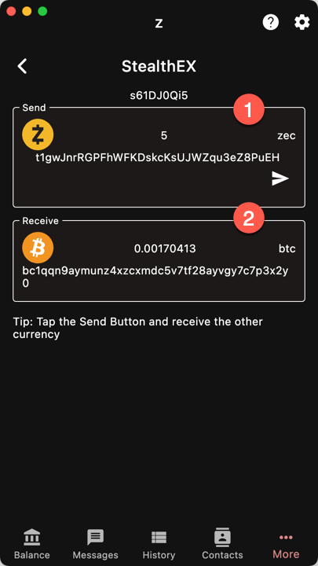
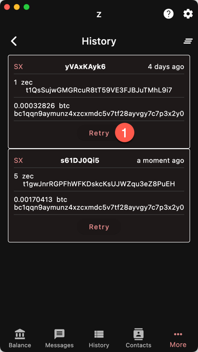

import { Callout } from "nextra/components"

`More/Swaps`

# Swaps

You can exchange ZEC for another crypto
currency with the Swap function. 

<Callout type="warning">
Swaps are offered by third party services.
Make sure you read their terms of services
and understand the risks involved. Ywallet
is not responsible for any funds lost!
</Callout>

> Ywallet may receive a referral commission
in some of the cases.

1. Choose one of the swap providers. At This
moment, we only have StealthEx but others 
will be added soon;
1. Show the list of swaps (pending or finished)
that were initiated recently.

## StealthEx

1. Enter source amount;
1. Enter source currency;
1. Choose *direction* of the swap;
1. Enter target currency;
1. Enter target address;
1. Tap to request a quote. The app will fill in
the target quantity;
1. Go to next step.

<Callout type="warning">
**Double check that the target address is correct**.
You MUST have the secret key otherwise you will not
be able to spend the funds.
</Callout>

## Reverse Swap

If you want to specify the amount *received* instead
of the amount sent, press the arrow to reverse the swap.
The source quantity will be calculated instead of
the destination quantity.

> The amount/currency at the top becomes the destination
amount/currency and vice-versa.

## Summary

This page shows a summary of the swap. If the currency
at the top is ZEC, you can press the arrow button
to send funds to the swap address. Otherwise you need
to make the transaction yourself (using another crypto
wallet).

The information at the bottom is where you will receive
the funds.

<Callout type="warning">
**Double check that all the information is correct
before sending the funds. The swap is not reversible**.
</Callout>

Ywallet does not monitor the swap progress (because
that would involve being able to monitor other blockchains).
Therefore this page remains opened until the user closes it.

## History

If you closed the summary page by accident, you can
retrieve it by going to the history page.

