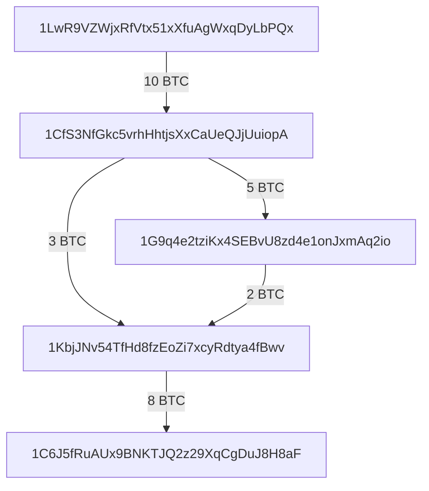

import { Callout } from "nextra/components"

Transparent Transactions are very similar to Bitcoin.

If you have a good understanding of the Bitcoin data model,
you can safely skip this section. Otherwise, here's a recap.

Transactions have *inputs* and *outputs*. Outputs are
payment recipients and are expressed as:
- a destination address,
- an amount (in ZEC or zats[^1])
- and a memo[^2]

> This is also called a **note**.

Inputs are previous outputs that have *not* been used yet.

<Callout type="warning">
It is forbidden to use or spend the same output twice!
</Callout>

Unlike outputs, inputs are not specified by their properties.
Instead, inputs are references to previous transaction outputs.
An input is a transaction ID[^3] and an output index.

This way, a validator can keep track of the unspent
transaction outputs in a database and mark them spent
when it sees a transaction that refers to them.

## Validation Process

The validation process is approximately:
- Check that outputs have a valid address and amount[^4];
- Check that inputs are valid. They must refer to previous
*unspent* transaction outputs (UTXO);
- Collect the amount associated with the inputs as part of
the previous step;
- Check that outputs do not exceed inputs in value. The
transaction *cannot* create funds[^5]. Any difference
are fees that are given to the miner;
- Check that the inputs have valid *signatures*. signatures
insure that only the person who received the funds
is able to spend them.

## Transaction Graph

Transactions form a acyclic graph that has links between
UTXO, i.e. notes.

Here's how a portion of the Bitcoin Graph could look like:

## Footnotes

[^1]: There are 100 000 000 zats per ZEC
[^2]: Technically, transparent outputs do not have memos for 
legacy reasons. We'll assume they have just to be consistent
with shielded transactions.
[^3]: Transaction ID are hashes of transactions
[^4]: The protocol only validates that the values are well-formed,
aka the amount is not negative, not too big, etc. But it cannot
verify that the address has a known secret key...
[^5]: The coinbase transaction where miners collect their reward
is an exception. But we will omit them for now.
