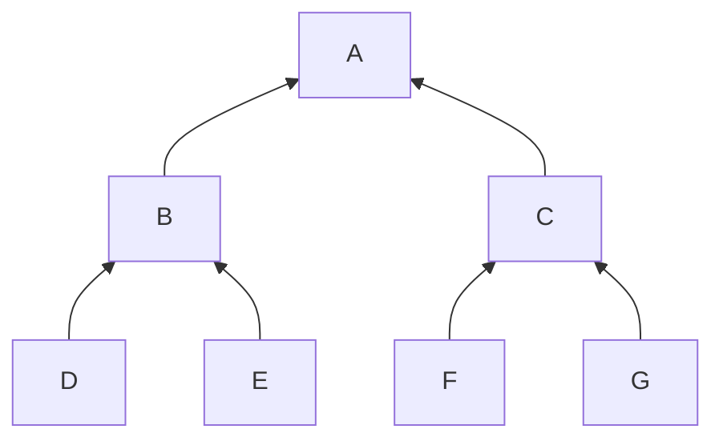

import { Callout } from "nextra/components"

## Append Commitment

There are a few important rules to our commitment tree:
1. Once a value is added, it cannot be removed or updated;
1. Adding a value means replacing the left-most EMPTY hash.

In other words, our tree is *append-only*.

## Merkle Proof

We receive a lot of commitments, millions of them.
But we only need to track *our* note commitments.
If cannot decrypt a note, we cannot spend it.

Among these millions of commitments, only a few
are to be tracked.

On request, i.e. when the user wants to spend
a note, we must produce the Merkle Proof.

The MP is the list of hashes obtained by 
traversing the tree from our commitment to
the root and collecting the *sibling* hash
along the path.

For example, in the following tree

the path for F is [F, C, A] and the proof is [G, B]. The
root has no sibling, therefore the proof is always shorter
(by 1) than the path.

You also need the commitment value F and its position[^1], 

<Callout>
The proof is (F, 2, [G, B]).
The commitment value and the position do not change.
**The challenging part is the list of hashes**. It
changes whenever a new commitment gets added to the tree.
</Callout>

## Incremental Appends

The tree is not *static*. Whenever we receive new blocks,
with new transactions and new outputs, the tree gets new
commitments and the proofs of our notes will change.

<Callout>
Updating our proofs efficiently is the main idea behind
Warp Sync.
</Callout>

Let's start with a simpler problem.

## Footnotes

[^1]: the position of F is 2 because the first commitment (D) has
position 0.