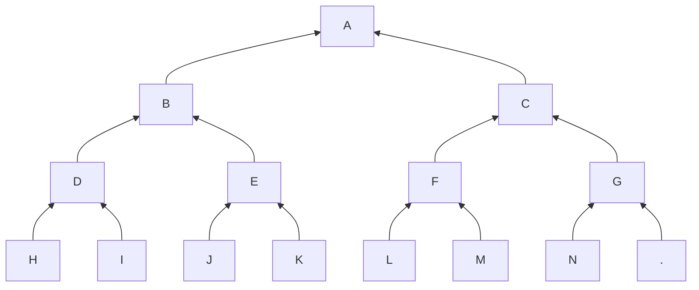

import { Callout } from "nextra/components"

Calculating the root of the commitment tree
is not useful. It is public information
that can be obtained by anyone. It is even
part of the block header.

We did it for illustration purpose and to
get familiar with the problem space.

Now, let's turn to the real problem: 
Merkle Proofs.

## Quick Reminder

The Merkle Proof for a note N at position
p is the triplet (N, p, $\pi$) where $\pi$
is the Merkle Path: The list of the *siblings*
(hashes) from N to the root.

Let's look our example tree:

The Merkle Proof for the note L is 
(L, 4, [M, G, B]). It enables the verifier
to compute the root A.

The position 4 gives the path to the note:
- write p is binary. p = 100b;
- replace 1 by R and 0 by L. The path is R, L, L;
- reverse it to get the path from the note to the root:
L, L, R;
- Use the sibling hashes to compute the intermediate
nodes.

We start with x := L[^1].
- First step is Left and the sibling is M: compute
x := Hash(x, M);
- Second step is Left again. Compute x := Hash(x, G);
- Last step is Right. Compute x := Hash(B, x).

At this point, we have x = A.

<Callout>
It is not computationally feasible to get
another proof for L because of the properties of the Hash
Function. Neither can we make a proof for a note
that does not belong to the commitment tree.
</Callout>

There are lots of notes in the tree but we own
**very few** of them: usually fewer than 1/1 million.

The goal is to produce the Merkle Proof for the notes
we own (that we didn't spent) whenever we want to spend,
i.e. at the current block height.

Again, we'll start with a simplified problem.

What state should we keep with our notes?

## Footnotes
[^1]: The sign := stands for "assign the variable on
the left hand side to expression on the right hand side".