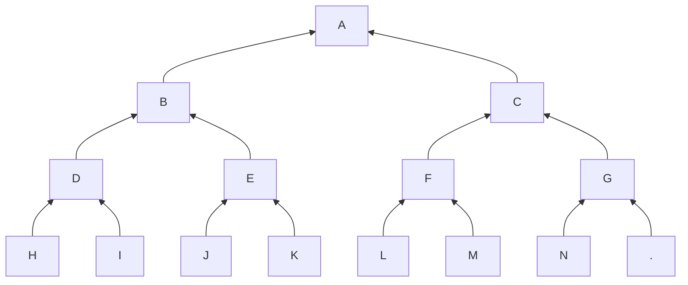
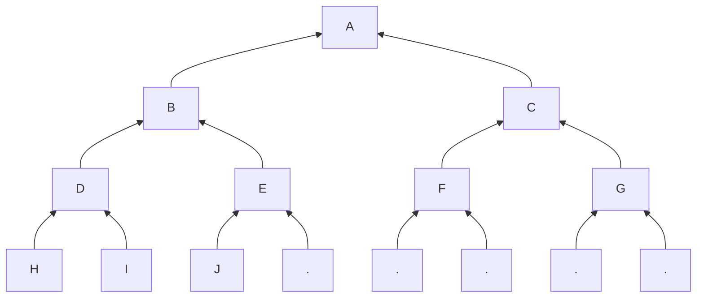
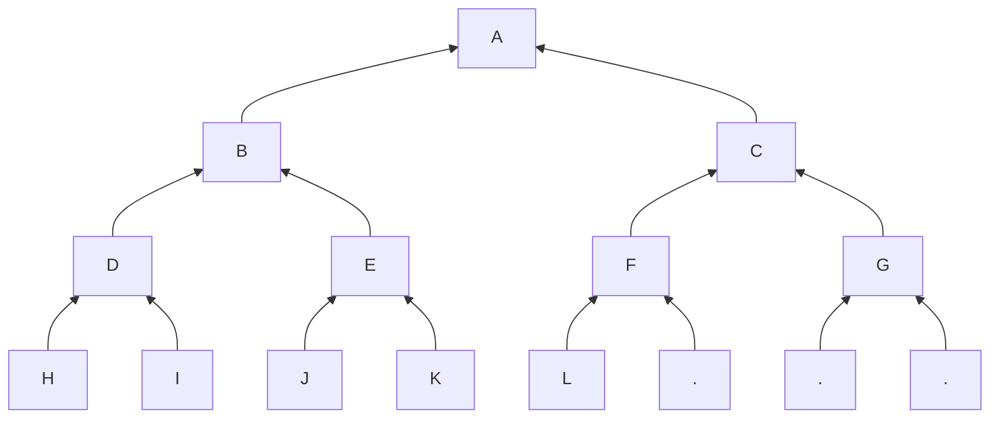

import { Callout } from "nextra/components"

In the simpler version, we don't care about our notes
and witnesses. We just want to calculate the *root* (hash)
of the tree.

But there is a caveat, we do not receive all the commitments
at once. We receive them in chunks[^1].

<Callout>
We must be able to return the root after every chunk.
</Callout>

Let's consider this *nearly full* tree:

and suppose we do not get like that.

We get [H, I, J], 

then [K, L],

and then finally
[M, N].

> How can we keep the least amount of data,
not repeat any calculation and still
return the same value of A at the end[^2]?

## Trivial (not optimal) solution

We can keep [H, I, ...] until we are asked
to compute the root.

However, 
1. We keep all the leaves. For Zcash, we already
have ~100 million entries;
1. If we need to calculate the root at a later time,
we will be repeating many of the same hash calculations.
For example D = Hash(H|I).

This is *not* efficient at all.

## Minimal but wrong

The smallest amount of data would be the current root hash.
But then it is impossible to update it correctly.
This solution clearly does not work.

## Right Solution

To get a better solution, we want to avoid repeating
the Hash calculations[^3].

Let's look at the first chunk. Once we received [H, I, J],
we can notice that D = Hash(H|I). D will not change anymore
because H and I cannot change. However, E will change
because now E = Hash(J|.). Eventually, E = Hash(J|K).

Therefore we don't want to calculate the intermediate E.
Same thing applies to B: B = Hash(D|E) but our E will change
later and so will B.

## Tree State

When we get the first chunk [H, I, J], we can merge (hash)
H & I, but if we merge (J, EMPTY) we are going to compute
unnecessary hashes. The hash we need is (J, K) but K
is not available yet. It's better to keep J for later.

If we generalize to every layer, the
state is either "null" or the node that forms the left
side of the last incomplete pair.

## Algorithm

<Callout>
When we receive a chunk, we do the following:
- align the nodes by prepending the previous left over
node if there is one. If we did not do that, then we 
would be hashing (K, L) instead of (J, K);
- if there is an odd number of nodes, save the last
node;
- hash each pair to get the next layer up.

Repeat until you reach the root.
</Callout>

## Example

### Initial State

Each layer starts with no left over node: 
state = (null, null, null)

### Chunk [H, I, J]

#### Layer 0 (leaves)

- Prepend previous node if needed. It's null so we skip
this step;
- Save the last node if the length is odd: J;
- Hash the remaining pairs: D = Hash(H, I).

State for layer 0: J

#### Layer 1

- Prepend previous node if needed. It's null so we skip
this step;
- We have [D]. The length is odd, we save it;
- We have nothing left so we stop

State for layer 1: D

#### Layer 2

- Nothing changed

State for layer 2: null

#### Tree State

> [J, D, null]

### Chunk [K, L]

#### Layer 0 (leaves)

- Prepend previous node if needed. It's J, so we get
[J, K, L];
- Save the last node if the length is odd: L;
- Hash the remaining pairs: E = Hash(J, K).

State for layer 0: L

#### Layer 1

- Prepend previous node if needed. It's D so we get
[D, E];
- The length is odd, we set the state to null;
- We hash B = Hash(D, E)

State for layer 1: null

#### Layer 2

- We just have [B]. It's odd length therefore
we save B.

State for layer 2: B

#### Tree State

> [L, null, B]

### Chunk [M, O]

We'll leave the detailed steps as an exercise.

The final tree state is [N, F, B]

## Final pass

We do not have the root value A but we have
the hashes needed to calculate it.

The root is obtained by using the tree state
as the Merkle Path of the next leaf (which is
empty by definition).

Starting with the first item of the tree state,
N, we calculate G = Hash(N, .).
Then we use the second item of the tree state, F:
C = Hash(F, G). Then finally A = Hash(B, C).

<Callout>
At every step we combine the current hash H.
- if there is saved hash X, we calculate Hash(X, H);
- otherwise, we calculate Hash(H, ER) where ER is the
[empty root](tree#empty-tree)
for that depth.
</Callout>

<Callout type="warning">
Note that this algorithm *overflows* if the tree
is full. If we add [O], the tree state resets to
[null, null, null] and we have an empty tree.
In practice, this is not an issue because the capacity
of the tree is much greater than what we need.
</Callout>

## Edge

The Intermediate Hashes calculated as we walk up
the tree to the root form the Edge of the tree.

> This will be used in the section regarding
[witnesses](witness).

## Summary

We saw how we can maintain the tree state with
a small amount of data (at most 32 hashes for Zcash).
It is *logarithmic* in the capacity of the tree ($2^{32}$).

Next, we'll consider how we can adapt this technique
to produce Merkle Proofs for arbitrary notes.

## Footnotes

[^1]: A chunk is a list of note commitments (i.e leaves).
[^2]: The intermediate values of A are different since
the tree was not in the same state.
[^3]: These are Pedersen Hashes. They require a significant
amount of Elliptical Curve calculations.