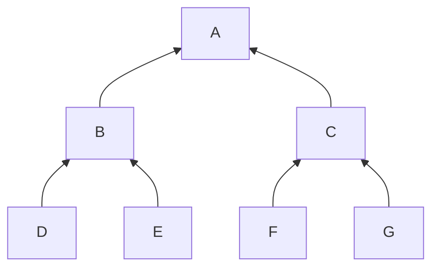

import { Callout } from "nextra/components"

Let's start with a description of our data structure.

For a tree of depth $D$, we have a root hash (32 bytes).
It is the result of hashing two values which are hashes
themselves. The subhashes are the result of hashing 
2 values each, for a total of 4. The process continues
D times where D is the depth of the tree.

The number of hashes at the last step is $2^D$.
In Zcash, D = 32 and we have roughly 4 billion "leaf" hashes.

<Callout>
The process of calculating the tree starts
at the leaves. Then proceed upwards towards the root.
Each layer is obtained by hashing both child nodes.
</Callout>

## Tree of depth 2



D, E, F, G are the input hashes.

They are note commitments to be exact that are points
on an Elliptical Curve. We use one of the coordinate,
a 32 byte value. Not all values correspond to a point,
therefore we know some hashes that will never be used
by a real note. One of them is chosen to be the EMPTY
hash[^1].

## Empty Tree

The empty tree, i.e. the tree before any note commitment
is added is entirely filled with the EMPTY hash *for
the leaves*[^2].

[^2]: The only user input to the tree are the leaves. The
rest is computed.

Then we fill in the internal nodes by hashing:
- B = Hash(D|E)
- C = Hash(F|G)

Since D = E = F = G = EMPTY, B = C.
Then A = Hash(B|C)

Even though in theory, we are supposed to calculate every
internal node, it is clear that for an empty tree,
each node at a given level has the same value.

And we only have $\mathsf{depth}+1$ different values.

You can compute the values of the empty tree
with the following code.

Note that the Hash function takes the index of the layer
as an input, along with the two child node hashes.

```rust
pub fn empty_roots<H: HasherBase>(empty: Hash, h: &H) -> [Hash; DEPTH] {
    let mut roots = vec![];
    roots.push(empty);
    for i in 0..DEPTH - 1 {
        roots.push(h.combine(i as u8, &roots[i], &roots[i], false));
    }
    roots.try_into().unwrap()
}
```

But an empty tree is not particularly useful. We want to add
our note commitments.

Next, let's add some values.

## Footnotes

[^1]: It is not 00000...
