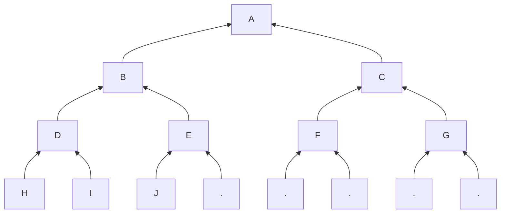

import { Callout } from "nextra/components"



Let's track one of the notes and track it.
For example H. H is the first note, i.e.
at position p = 0.

## Initial Merkle Proof
What is its Merkle Proof $\pi$?

From the position p, we figure out the path
from the root: L, L, L.

**At the moment the note was added**, 
there are no notes after it since it is
an incremental tree.

Therefore whenever we have a L node, we
know that the right node is the empty root.

If we have a R node, we must have the
left node.

For example, node I has position 1
and path L, R, L. The path is therefore 
[H, EMPTY, EMPTY].

<Callout>
We do not need to store the EMPTY hashes
because they can be shared/cached.
</Callout>

Then a witness is

```rust
pub struct Path {
    pub value: Hash,
    pub pos: usize,
    pub left: Vec<Hash>,
}
```

The path changes later as nodes are added to the tree.

## Right Nodes

Left nodes will never change, but right nodes are
different.

They all start equal to the empty root of their
corresponding depth but then they start to evolve
into their final value.

For example for I, the layer 1 starts as 
empty root of depth 1. Then with J, the
value at E changes. 

> However, just like when
we were working to calculate the root,
we do not want to compute intermediate hashes.

The Right nodes are not stored until we
get to K.

If the Merkle Proof needs to be obtained
before we get K, for example after receiving
[H, I, J], then E is the current Edge of the
tree. See [Edge](root#edge).

The definition of a Witness is
```rust
pub struct Witness {
    pub path: Path, // path when the witness was created
    pub right: Vec<Hash>, // right nodes added after
}
```

Where the right nodes are added when we
hash them as part of the process described
in the Algorithm used to compute the
[root](root#algorithm).

## Merkle Proof

To get the Merkle Proof, we follow the same
principle as before:
- From the position, we deduce the path;
- We follow the path, looking for the 
Left or the Right sibling;
- If we need the Left node, we have
it in the `path.left` vector;
- If we need the right node, we have it
in `right` vector. However, when we run
out right nodes, we pick up the node
from the tree Edge (at the current depth,
only *once*), and then from the empty roots
(for the remaining ones).

In the next and final section, 
we'll discuss Bridges, an important
performance optimization.
